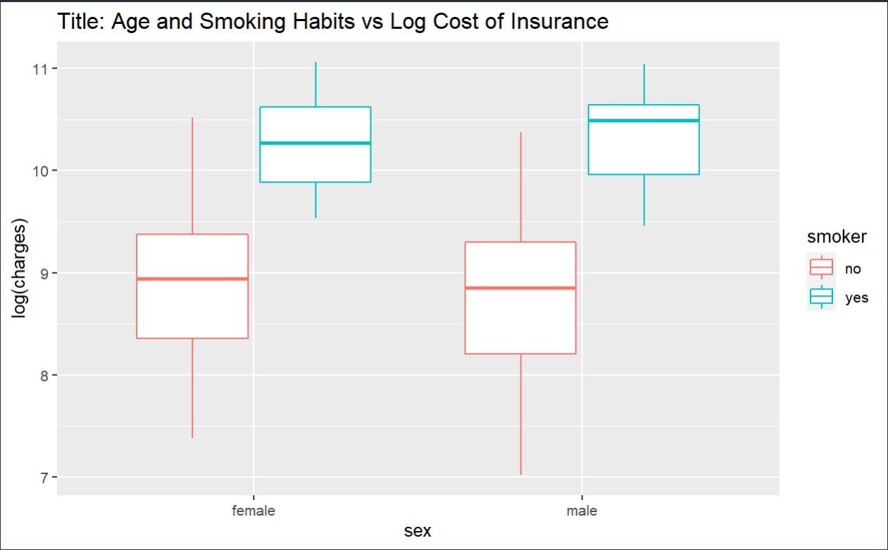

---
title: "Analysis of Insurance Cost on Patient Demographics"
author: "Daksh Verma, Evan Patel, Maxine Attobrah, Saurabh Rane, Sujay Shah, Tejas Dighe"
date: "May 8, 2022"
output: pdf_document
---

# Abstract

Health insurance costs are a cause of significant concern in the United States, particularly across all age groups. Our aim is to understand the factors affecting the cost of health insurance and whether they can be used to predict the future costs. The primary motivation is to help people plan better for their projected future health insurance costs. We predicted the cost of health insurance based on selected attributes of individuals across age groups of ~18-90 years and found correlations to the cost of insurance. After building several visualizations and models to understand our data, we determined that smoking status, age, and BMI were the biggest influential factor in determining the cost, irrespective of the individual’s geographical location in the United States. While we initially believed gender would be a strong predictor of costs due to the differences in health needs, age and BMI were far more influential in helping predict the cost of insurance. Therefore, we believe our analysis will help understand the factors driving costs for insurance. While we can help shape public policy from this data-driven approach, it is important to understand biases and limitations of this methodology. Especially in fields like healthcare where policy decisions can affect millions of people, it is imperative for policy makers to be cognizant of the checks and balances required while using data science. Lastly, the findings can influence behavior in the population to reduce healthcare costs for the future.

# Introduction

## Use of data science and machine learning in healthcare and public policy
Data Science and Machine Learning are emerging technologies that have been widely used and applied across various products and industries, especially in healthcare. It can play a huge role in industries like finance and life sciences owing to its capability of discovering patterns across large datasets. ^[1]^ Data science and machine learning have been used in drug discovery, to predict diseases, decision support, and predicting readmission rates in hospitals, amongst other applications in healthcare^[2]^. Applied data science has also been used in diverse policy perspectives. They have been used to predicting crime risks, healthcare violations, and effective interventions.^[3,4]^

Massive amounts of clinical data is available due to the digitalization of medical records. Therefore, we have seen an influx of data science interventions in medicine, particularly to gain insights and knowledge for decision making. However, there are multiple challenges with using data science in healthcare. In an example of using ICU data, where there is a crucial need of evidence-based case management in complex illnesses, data science can help make decisions for better patient outcomes. Despite an increase in the number of publications and studies, very few projects have actually been implemented in the ICU ecosystem^[5]^. In addition, when data science and machine learning are used to bring policy changes, it can present a whole new set of challenges and benefits. For example, it could induce a strategic shift in behavior. If our models can identify which factors most influence a certain decision, the user or individual could modify their decisions or actions to attain maximum benefit. This could be beneficial in sectors like healthcare, where patients can use this information to change their lifestyle with healthcare costs as a significant motivator. However, in sectors like crime, it would be detrimental as people could change and manipulate signals^[6]^ on factors that classify them as potential criminals or high-risk individuals. Another big challenge using data science for predictions is the inherent inclusion of human biases which manifest as systemic gaps. The datasets can induce a bias within the algorithm depending on how the data was collected and for what purpose it was utilized. Finally, it’s not always possible or easy to implement the results that a model provides the user. It could be difficult or impossible to implement certain interventions due to political circumstances, financial constraints, or personal perspectives of key decision makers^[7]^. This makes the application of data science, especially in the field of healthcare insurance, important but difficult to implement.

## Health insurance in the United states: Coverage and factors affecting costs

Health insurance is the mechanism for an individual to pay for their healthcare expenses. Most of the population have private insurance through their workplace or employer, but others could also obtain it through the state or the federal government^[9]^. Every year, the coverage and rates of health insurance are subject to change based on the economy, population demography change, and policies around healthcare^[9]^. COVID-19 put forward an unprecedented governance challenge, especially for healthcare and insurance.  In the United states where healthcare insurance plays a big role in access to healthcare, the federal government and state governments had fragmented decisions[8]. Pre COVID-19, in 2019, roughly ~27.5 million people in the US did not have health insurance- that’s nearly 8.5% of the US population. There was obviously a heavy skew towards private healthcare insurance users with over ~67% people falling in that bucket, since employer based health insurance is the most popular form of insurance in the US. Government programs like ‘Medicaid’ or ‘Medicare’ covered ~33% of the population^[10]^. 

There are multiple factors that affect the premium costs for healthcare insurance. There are multiple factors that can determine the cost^[11]^. State and federal laws can dictate what the insurance can and cannot cover or charge. The state of residence can also cause a variance in the costing of insurance. In addition, premiums tend to be lower in urban areas and also it depends from county to county. The type of insurance that an individual buys also determines how much they pay or if the employer's group plan covers a section of the healthcare insurance cost. Moreover, the insurance comes large at scale and therefore is cheaper for large companies. The income level has a big role in the insurance cost, for example the low wage workers tend to pay less through federal or state as they receive subsidies. There are also multiple plans which come across different price ranges. Finally, age and smoking plays an extensive role determining the price of health insurance. For example, the rates hike up with age, and the premium for tobacco users can cost upwards of 50% than non-smokers^[12]^. There are certain factors that cannot affect the healthcare insurance costs like gender, as insurance companies aren’t allowed to charge men and women differently for the same plans^[12]^. 

## Motivation
The ACA (Affordable Care Act) was created in 2010 and is known as ‘Obamacare’ which extends to millions of people. However, the ACA also made healthcare insurance mandatory^[13]^.  
As of 2020, the average cost of health insurance in the US was $456 per month for a single person and $1152 per month for a family^[14]^. While there are multiple factors affecting the costs of insurance plans, these prices are high for a big section of the population. Moreover, the most vulnerable populations are most affected by the prices of the insurance premiums. In the US, ~37.2 million people were in poverty in 2020, which was ~3.3 million more than 2019^[15]^. Similar patterns were observed for age groups under 18, where poverty rates jumped from 14.4% to 16.1% from 2019 to 2020. For the age ranges of 18-64 years, the poverty rates went from 9.4% to 10.4% in 2020, and for people above 65 years of age, it was stagnant at 9.0%. There was a significant change in the poverty levels for Hispanics and Blacks (19.5%)^[15]^. Therefore, in this paper we wish to explore the various factors that have the highest influence on the cost of healthcare insurance premiums through various modeling efforts and also predict healthcare costs. Through this paper we hope to uncover new correlations or confirm existing beliefs regarding factors that might be in an individual's control to minimize healthcare insurance costs. 

# Data
## Information on the dataset
This data is called the ‘​​Medical Cost Personal Datasets’ and the paper uses this publicly available dataset to build models.  The data for this paper was obtained from Kaggle, which primarily hosts multiple data-sets across all domains including healthcare, finance, manufacturing, and agriculture, amongst others. The dataset is also associated with a book called ‘Machine Learning by R’ written by Brett Lantz. It seems that Packt Publishing used this dataset or similar dataset for teaching or conducting experiments. The dataset is small in size with only ~1339 rows, seems fairly straightforward, and needs no cleaning or pre-processing. Exhibit 1 is a table that contains the columns along with their brief descriptions.

## Cleaning and transformation
The dataset we chose was already cleaned and transformed into rows of data with the columns above. There was no missing data, which was useful for utilizing all of the dataset.

## Exploratory data analysis
First, we explored the data to see if we can find any biases in the data. We first analyzed the age of people in the dataset to find that the dataset contains a wide spectrum of age groups. However, the data dataset has more younger people than older people. We will comment on the effect of this bias in the discussion section if it is of any significance to our modeling efforts or results. Similarly, we found another bias in the quantum of individuals who smoke, as there are more non-smokers in the dataset. Finally, there are roughly the same number of men and women within this dataset (Refer to figure 1,2, and 3). Second, we looked at the relation between the age and payment for health insurance. We drew a line plot and observed that as a person gets older they are more likely to pay more in insurance regardless of their gender (Refer to figure 4 in the appendix). We also looked at the age v/s cost of insurance and we constructed a scatter plot for this purpose (Refer to figure 5). There was no clear observation whether the sex of an individual affects the cost of insurance. It seemed that from this graph gender may not play a role in the cost of medical insurance. It’s clear that some further analysis is needed (Refer to figure 6 in the appendix).

In addition, we looked at the cost of Insurance (Female vs Male) and the bar plot in the figure 6 in the appendix shows that men might be paying higher in insurance most times than women. We then created histograms based on gender and both histograms are skewed to the right.  This means that the majority of the people in the dataset are paying lower insurance costs. After taking the log transformation of the data we can clearly see that after about 9.6 there is a small amount of people paying higher insurance costs which is skewing the original data to the right (refer to figure 7,8, 9, and 10 in the appendix). 
We also looked at the cost of insurance based on age and smoking status. In the previous graph we noticed that there are alot of data points on top of each other. After using geom_jitter() and taking the log transform of the cost we can see very clearly that the people paying the most are smokers. The cost of insurance seems to be more influenced on whether or not a person smokes Majority of the people that do not smoke pay less in insurance. However, there are more people that do not smoke that have high insurance costs. Further investigation is needed to see why (refer to figure 11).

We plotted the cost of insurance based on age and smoking conditions. From the box plots we can see that there is a big difference between what smokers and non-smokers have to pay regardless of age (refer to figure 14 in the appendix). The minimum insurance cost for smokers is higher than what 75% of non-smokers pay for insurance (refer to figure 12).

Moving ahead, we wanted to check if the number of children has an affect on health insurance. We created a face wrap graph for this purpose. In this graph we break down by the number of children a person has. Each subplot represents how many children a group of people have. Here we can see that for those that do not smoke the insurance price is influenced by the number of children that they have. The less children a person has the more likely they are to have a higher insurance cost (refer to figure 13 in appendix). 

We finally conclude our EDA by showing heatmaps of the correlation matrix (refer to figure 15). The heatmap shows which variables have the strongest correlation with a person's insurance cost. Irrespective of location, the strongest influencer is the smoker variable. The next strongest influencer is BMI. Initially, it was observed that gender had a stronger influence on charges than the number of children but as we took a deeper dive into each region that was not the case. The influence of the number of children and gender on charges depends on which region (refer to figure 16,17,18, and 19 in the appendix) a person is in.

  
  
  
\newpage
  
# Methods

## Research Questions and Preliminary Hypotheses
Based on the research data and the data set we obtained, we analyzed the factors that may affect the insurance charges. We hypothesized that factors within a degree of patient’s control like BMI and smoking habits would correlate with insurance costs. This hypothesis is supported by the correlation chart from the EDA section where smoking and BMI have the strongest correlations to costs. In addition, we would like to expose another factor with a wide range that can be a potentially overwhelming factor in determining costs. From the EDA, the best candidate appears to be age as the feature with the second strongest correlation. We also hypothesized that the number of children and demographics do not impact the medical insurance charges. The data does not show much variation with respect to changing demographics. And the data is insufficient to analyze the variation in insurance prices based on the number of children. Therefore, based on all these factors, we came up with the following questions to conduct the research:
\newline
1. Can average insurance prices be predicted based on gender, age, BMI, and smoking habits?
\newline
2. Which model is the best predictor of insurance prices given these strongly correlated features?

## Choice of models based on data

### Linear Regression Model using OLS

We wanted to see if there is a linear relationship between our independent variables (age, bmi and smoker) and our dependent variable (charges) so we decided to use a linear regression model.

A linear regression model makes 5 assumptions which are the Gauss Markov assumptions. These assumptions are:
Linearity: The relationship between the dependent variable and independent variable is linear
Non-colinearity: The dependent variables are independent of each other
Homoscedasticity: There is not a huge change for each error of the independent variables
Random sampling: The data is randomly sampled
Exogeneity: Regressors are not correlated with the error term

In addition, to test the level of generalization in the model, we experimented with several splits of training to test data ratios to determine the level of generalization to best model to balance bias-variance in the model.

### Random Forest

The second model chosen was a random forest regression model to predict the insurance charges based on a select subset of features in the dataset. Random forest is a type of ensemble method that combines multiple decision trees that uses a technique called bagging to use random subsets of features at each decision node on each tree, then combines the results to predict regression values. Random forest models are useful because the volume of uncorrelated models helps reduce variance by avoiding overfitting training data. A random forest model can help better understand which variable(s) are best to split on first and which variables are good predictors only after another variable is determined. The training to test data ratio was fixed to focus on the search for best hyperparameters for the model.

